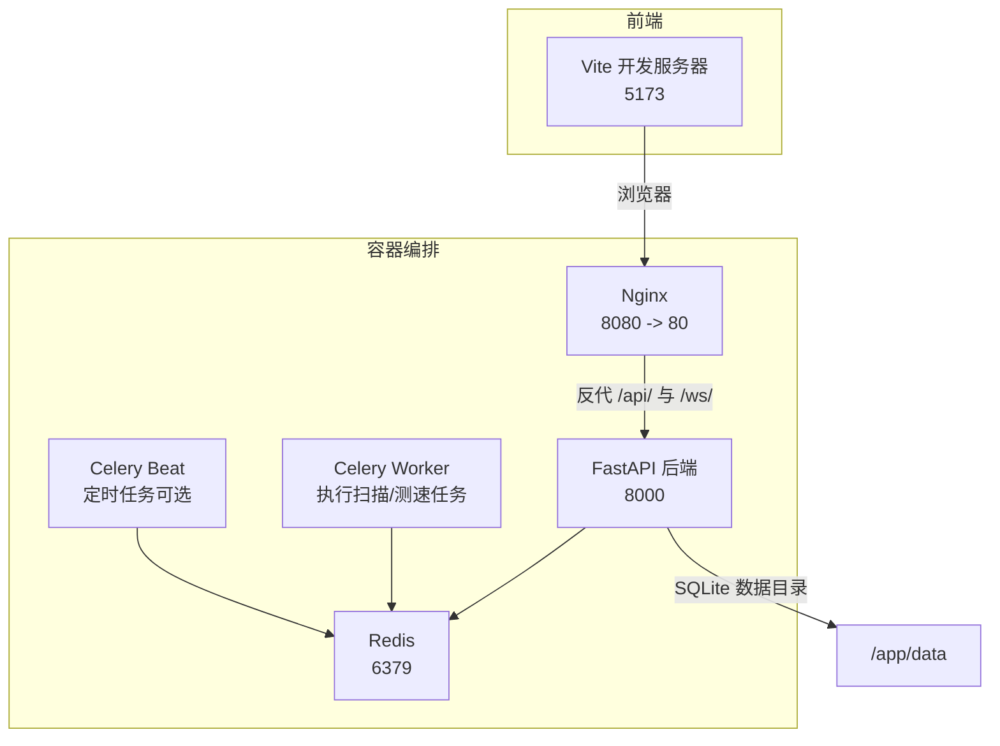
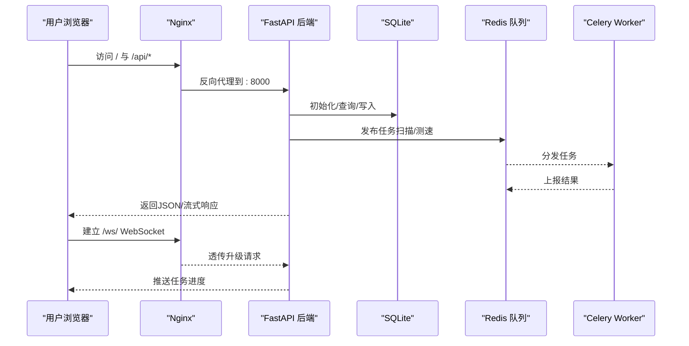
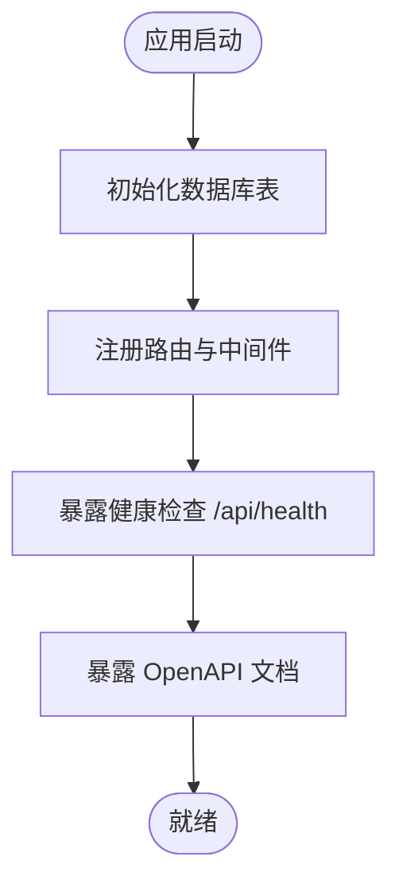
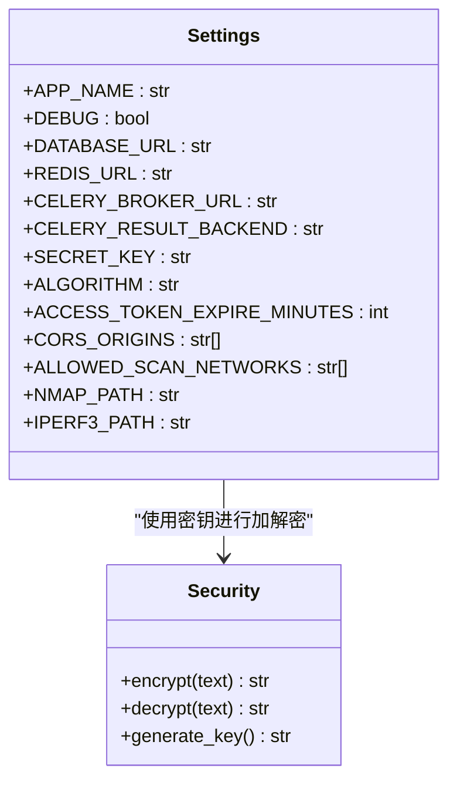
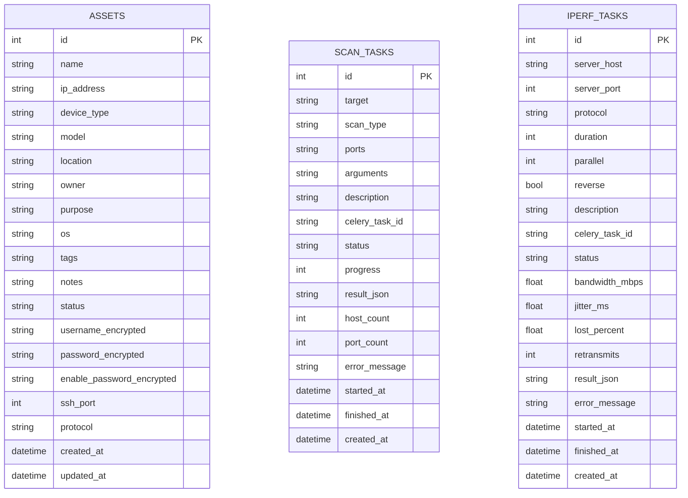
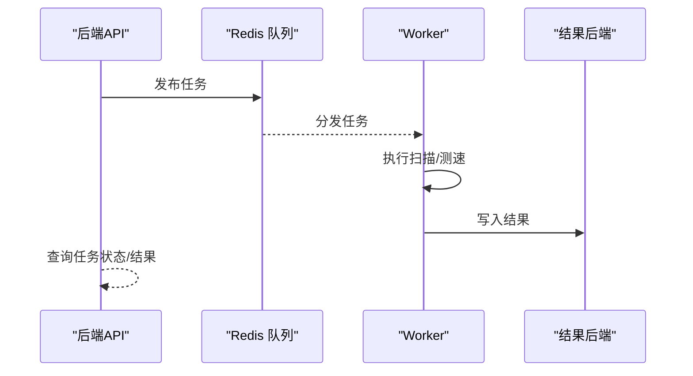
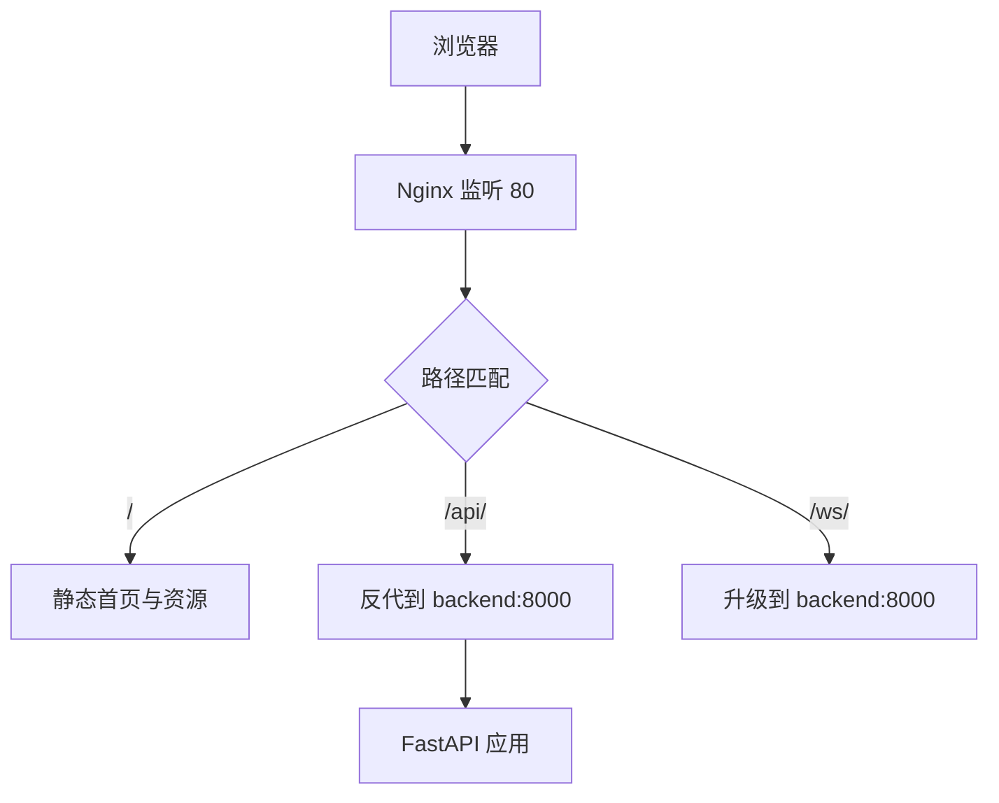
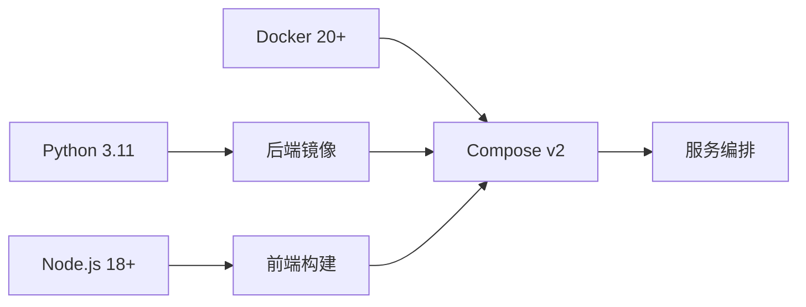

# 快速开始

<cite>
**本文引用的文件**
- [docker-compose.yml](file://ops-platform/docker-compose.yml)
- [Dockerfile](file://ops-platform/backend/Dockerfile)
- [nginx.conf](file://ops-platform/nginx/nginx.conf)
- [requirements.txt](file://ops-platform/backend/requirements.txt)
- [main.py](file://ops-platform/backend/app/main.py)
- [config.py](file://ops-platform/backend/app/core/config.py)
- [database.py](file://ops-platform/backend/app/core/database.py)
- [worker.py](file://ops-platform/backend/app/tasks/worker.py)
- [router.py](file://ops-platform/backend/app/api/v1/router.py)
- [assets.py](file://ops-platform/backend/app/api/v1/assets.py)
- [asset.py](file://ops-platform/backend/app/models/asset.py)
- [scan_task.py](file://ops-platform/backend/app/models/scan_task.py)
- [iperf_task.py](file://ops-platform/backend/app/models/iperf_task.py)
- [.gitignore](file://ops-platform/.gitignore)
- [package.json](file://ops-platform/frontend/package.json)
</cite>

## 目录
1. [简介](#简介)
2. [项目结构](#项目结构)
3. [核心组件](#核心组件)
4. [架构总览](#架构总览)
5. [详细组件分析](#详细组件分析)
6. [依赖分析](#依赖分析)
7. [性能考虑](#性能考虑)
8. [故障排查指南](#故障排查指南)
9. [结论](#结论)
10. [附录](#附录)

## 简介
本指南面向需要快速搭建与运行“内网运维集成工具平台”的用户，覆盖环境准备、本地开发环境搭建、生产环境部署、基础配置说明与常见问题处理。平台提供资产台账管理、Nmap内网扫描、Iperf3网络性能测试三大能力，采用FastAPI后端、Vue前端、Redis消息队列、Celery异步任务、SQLite数据库与Nginx反向代理的容器化方案。

## 项目结构
项目采用前后端分离与容器编排的组织方式：
- 后端：FastAPI + SQLModel + Celery + Redis
- 前端：Vue 3 + Vue Router + Pinia + Element Plus
- 运维：Docker + Docker Compose + Nginx
- 数据：SQLite（默认）或可替换为PostgreSQL/MySQL（需调整配置）

图表来源
- [docker-compose.yml:1-95](file://ops-platform/docker-compose.yml#L1-L95)
- [nginx.conf:1-43](file://ops-platform/nginx/nginx.conf#L1-L43)
- [Dockerfile:1-25](file://ops-platform/backend/Dockerfile#L1-L25)

章节来源
- [docker-compose.yml:1-95](file://ops-platform/docker-compose.yml#L1-L95)
- [Dockerfile:1-25](file://ops-platform/backend/Dockerfile#L1-L25)
- [nginx.conf:1-43](file://ops-platform/nginx/nginx.conf#L1-L43)

## 核心组件
- 应用入口与生命周期：FastAPI 应用在启动时自动初始化数据库表结构，提供健康检查接口与OpenAPI文档。
- 配置中心：通过 pydantic-settings 从 .env 文件加载配置，支持数据库、Redis、CORS、扫描白名单、工具路径等。
- 数据层：SQLModel + SQLite，默认使用 SQLite 文件存储；Redis 用于 Celery 的消息队列与结果后端。
- 异步任务：Celery + Redis，支持扫描与测速两类任务队列，具备软超时、硬超时、结果过期等策略。
- 反向代理：Nginx 提供静态资源托管、API 反代、WebSocket 升级与缓存优化。
- 前端：Vite 开发服务器，构建产物由 Nginx 提供静态服务。

章节来源
- [main.py:1-48](file://ops-platform/backend/app/main.py#L1-L48)
- [config.py:1-40](file://ops-platform/backend/app/core/config.py#L1-L40)
- [database.py:1-17](file://ops-platform/backend/app/core/database.py#L1-L17)
- [worker.py:1-30](file://ops-platform/backend/app/tasks/worker.py#L1-L30)
- [nginx.conf:1-43](file://ops-platform/nginx/nginx.conf#L1-L43)
- [package.json:1-1](file://ops-platform/frontend/package.json#L1-L1)

## 架构总览
下图展示从浏览器到后端服务、再到异步任务执行的整体链路：

图表来源
- [docker-compose.yml:73-86](file://ops-platform/docker-compose.yml#L73-L86)
- [nginx.conf:12-30](file://ops-platform/nginx/nginx.conf#L12-L30)
- [main.py:45-48](file://ops-platform/backend/app/main.py#L45-L48)
- [worker.py:1-30](file://ops-platform/backend/app/tasks/worker.py#L1-L30)

## 详细组件分析

### 后端应用与生命周期
- 应用启动时执行数据库初始化，确保表结构存在。
- 提供 /api/health 健康检查接口，OpenAPI 文档位于 /api/docs。
- 允许来自前端开发与内网的跨域访问，便于联调。

图表来源
- [main.py:15-48](file://ops-platform/backend/app/main.py#L15-L48)

章节来源
- [main.py:1-48](file://ops-platform/backend/app/main.py#L1-L48)

### 配置中心与安全
- 配置项涵盖应用名、版本、调试模式、数据库URL、Redis/Celery连接、加密算法、CORS白名单、扫描允许网段、外部工具路径等。
- 加密模块基于 Fernet，要求在 .env 中设置密钥，否则会抛出运行时错误。

图表来源
- [config.py:8-40](file://ops-platform/backend/app/core/config.py#L8-L40)
- [security.py:1-22](file://ops-platform/backend/app/core/security.py#L1-L22)

章节来源
- [config.py:1-40](file://ops-platform/backend/app/core/config.py#L1-L40)
- [security.py:1-22](file://ops-platform/backend/app/core/security.py#L1-L22)

### 数据模型与API
- 资产模型包含设备基本信息、凭据字段（加密存储）、SSH端口与协议等。
- 资产API支持分页查询、增删改查、凭据解密读取、Excel导出等功能。
- 扫描与测速任务模型分别记录任务状态、进度、统计指标与结果JSON。

图表来源
- [asset.py:19-73](file://ops-platform/backend/app/models/asset.py#L19-L73)
- [scan_task.py:12-43](file://ops-platform/backend/app/models/scan_task.py#L12-L43)
- [iperf_task.py:14-47](file://ops-platform/backend/app/models/iperf_task.py#L14-L47)

章节来源
- [assets.py:1-75](file://ops-platform/backend/app/api/v1/assets.py#L1-L75)
- [asset.py:1-73](file://ops-platform/backend/app/models/asset.py#L1-L73)
- [scan_task.py:1-43](file://ops-platform/backend/app/models/scan_task.py#L1-L43)
- [iperf_task.py:1-47](file://ops-platform/backend/app/models/iperf_task.py#L1-L47)

### 异步任务与队列
- Celery 使用 Redis 作为 Broker 与结果后端，定义了扫描与测速两个专用队列。
- 任务具备软/硬超时、结果过期、延迟确认、公平调度等策略，保障稳定性与可观测性。

图表来源
- [worker.py:1-30](file://ops-platform/backend/app/tasks/worker.py#L1-L30)
- [docker-compose.yml:37-71](file://ops-platform/docker-compose.yml#L37-L71)

章节来源
- [worker.py:1-30](file://ops-platform/backend/app/tasks/worker.py#L1-L30)
- [docker-compose.yml:37-71](file://ops-platform/docker-compose.yml#L37-L71)

### 反向代理与静态资源
- Nginx 将前端静态文件与后端 API 统一对外提供，支持 WebSocket 升级与静态资源缓存。
- 通过 /api/ 反代至后端服务，/ws/ 透传升级头以支持实时进度推送。

图表来源
- [nginx.conf:1-43](file://ops-platform/nginx/nginx.conf#L1-L43)
- [docker-compose.yml:73-86](file://ops-platform/docker-compose.yml#L73-L86)

章节来源
- [nginx.conf:1-43](file://ops-platform/nginx/nginx.conf#L1-L43)
- [docker-compose.yml:73-86](file://ops-platform/docker-compose.yml#L73-L86)

## 依赖分析
- Python 版本：后端镜像基于 python:3.11-slim，建议宿主机也使用 Python 3.11。
- Node.js 版本：前端 package.json 显示使用 Vite 5.x，建议 Node.js 18+。
- Docker 与 Docker Compose：编排文件使用 version 3.9，建议 Docker Engine 20+、Compose Plugin 或 Compose v2。
- 外部工具：容器中已安装 nmap、iperf3、curl；如需直接调用宿主机二进制，可按注释调整网络模式。

图表来源
- [Dockerfile:1-25](file://ops-platform/backend/Dockerfile#L1-L25)
- [requirements.txt:1-38](file://ops-platform/backend/requirements.txt#L1-L38)
- [package.json:1-1](file://ops-platform/frontend/package.json#L1-L1)
- [docker-compose.yml:1-95](file://ops-platform/docker-compose.yml#L1-L95)

章节来源
- [Dockerfile:1-25](file://ops-platform/backend/Dockerfile#L1-L25)
- [requirements.txt:1-38](file://ops-platform/backend/requirements.txt#L1-L38)
- [package.json:1-1](file://ops-platform/frontend/package.json#L1-L1)
- [docker-compose.yml:1-95](file://ops-platform/docker-compose.yml#L1-L95)

## 性能考虑
- 数据库：SQLite 默认轻量，适合小规模场景；高并发或复杂查询建议迁移到 PostgreSQL/MySQL 并配置连接池。
- Redis：使用独立容器，建议开启持久化与合理内存上限；结果后端与队列分离可提升吞吐。
- 任务超时：扫描/测速任务具备软/硬超时，避免长时间占用 Worker；根据目标规模调整并发与队列数量。
- 前端缓存：Nginx 对静态资源启用缓存与压缩，降低带宽与首屏时间。
- 网络工具：容器内调用 nmap/iperf3，若宿主机性能更好可考虑直连宿主机二进制（按注释调整网络模式）。

## 故障排查指南
- 启动后无法访问前端页面
  - 检查 Nginx 是否映射 8080 到宿主，确认前端构建产物已生成并挂载到 /usr/share/nginx/html。
  - 参考：[docker-compose.yml:73-86](file://ops-platform/docker-compose.yml#L73-L86)，[nginx.conf:1-43](file://ops-platform/nginx/nginx.conf#L1-L43)
- API 404 或跨域失败
  - 确认路由前缀与反代路径一致，检查 CORS_ORIGINS 配置是否包含前端访问地址。
  - 参考：[main.py:32-39](file://ops-platform/backend/app/main.py#L32-L39)，[config.py:26-30](file://ops-platform/backend/app/core/config.py#L26-L30)
- 任务无法执行或无结果
  - 检查 Redis 连接、Worker 是否正常运行、队列是否正确发布。
  - 参考：[worker.py:1-30](file://ops-platform/backend/app/tasks/worker.py#L1-L30)，[docker-compose.yml:37-71](file://ops-platform/docker-compose.yml#L37-L71)
- 数据库初始化失败
  - 确认 SQLite 文件权限与 /app/data 目录挂载，或切换为其他数据库并更新 DATABASE_URL。
  - 参考：[database.py:1-17](file://ops-platform/backend/app/core/database.py#L1-L17)，[Dockerfile:19-21](file://ops-platform/backend/Dockerfile#L19-L21)
- 加密密钥未配置
  - 在 .env 中设置 FERNET_KEY，否则会触发运行时错误。
  - 参考：[security.py:4-8](file://ops-platform/backend/app/core/security.py#L4-L8)
- .env 文件被忽略
  - .gitignore 默认忽略 .env，首次部署请手动创建 .env 并填写必要参数。
  - 参考：[.gitignore:17-21](file://ops-platform/.gitignore#L17-L21)

章节来源
- [docker-compose.yml:73-86](file://ops-platform/docker-compose.yml#L73-L86)
- [nginx.conf:1-43](file://ops-platform/nginx/nginx.conf#L1-L43)
- [main.py:32-39](file://ops-platform/backend/app/main.py#L32-L39)
- [config.py:26-30](file://ops-platform/backend/app/core/config.py#L26-L30)
- [worker.py:1-30](file://ops-platform/backend/app/tasks/worker.py#L1-L30)
- [database.py:1-17](file://ops-platform/backend/app/core/database.py#L1-L17)
- [Dockerfile:19-21](file://ops-platform/backend/Dockerfile#L19-L21)
- [security.py:4-8](file://ops-platform/backend/app/core/security.py#L4-L8)
- [.gitignore:17-21](file://ops-platform/.gitignore#L17-L21)

## 结论
通过 Docker Compose 一键编排，平台可在本地或生产环境快速部署。建议在生产环境中替换 SQLite 为更稳健的关系型数据库、配置 SSL 证书、完善监控与日志采集，并对 Redis 与 Worker 进行资源与并发调优。

## 附录

### 环境准备清单
- Python：3.11（建议使用虚拟环境）
- Node.js：18+
- Docker Engine：20+
- Docker Compose：v2 或 Compose Plugin
- 外部工具：nmap、iperf3（容器内已安装，也可使用宿主机二进制）

章节来源
- [Dockerfile:1-25](file://ops-platform/backend/Dockerfile#L1-L25)
- [requirements.txt:1-38](file://ops-platform/backend/requirements.txt#L1-L38)
- [package.json:1-1](file://ops-platform/frontend/package.json#L1-L1)

### 本地开发环境搭建步骤
- 准备后端
  - 进入后端目录，安装依赖：参考 [requirements.txt:1-38](file://ops-platform/backend/requirements.txt#L1-L38)
  - 创建 .env 并填写数据库、Redis、CORS、扫描范围、工具路径等配置：参考 [config.py:8-40](file://ops-platform/backend/app/core/config.py#L8-L40)
  - 初始化数据库：应用启动时自动执行，或手动调用数据库初始化函数：参考 [database.py:10-12](file://ops-platform/backend/app/core/database.py#L10-L12)
  - 启动后端服务：参考 [main.py:22-30](file://ops-platform/backend/app/main.py#L22-L30)
- 准备前端
  - 进入前端目录，安装依赖：参考 [package.json:1-1](file://ops-platform/frontend/package.json#L1-L1)
  - 启动开发服务器：参考 [package.json:1-1](file://ops-platform/frontend/package.json#L1-L1)
- 准备 Redis
  - 使用 Docker Compose 启动 Redis：参考 [docker-compose.yml:4-14](file://ops-platform/docker-compose.yml#L4-L14)
- 启动异步任务
  - 启动 Celery Worker：参考 [docker-compose.yml:37-54](file://ops-platform/docker-compose.yml#L37-L54)，[worker.py:1-30](file://ops-platform/backend/app/tasks/worker.py#L1-L30)
  - 可选启动 Celery Beat：参考 [docker-compose.yml:56-71](file://ops-platform/docker-compose.yml#L56-L71)

章节来源
- [requirements.txt:1-38](file://ops-platform/backend/requirements.txt#L1-L38)
- [config.py:8-40](file://ops-platform/backend/app/core/config.py#L8-L40)
- [database.py:10-12](file://ops-platform/backend/app/core/database.py#L10-L12)
- [main.py:22-30](file://ops-platform/backend/app/main.py#L22-L30)
- [package.json:1-1](file://ops-platform/frontend/package.json#L1-L1)
- [docker-compose.yml:4-14](file://ops-platform/docker-compose.yml#L4-L14)
- [docker-compose.yml:37-71](file://ops-platform/docker-compose.yml#L37-L71)
- [worker.py:1-30](file://ops-platform/backend/app/tasks/worker.py#L1-L30)

### 生产环境部署流程
- 准备主机
  - 安装 Docker 与 Docker Compose
  - 配置防火墙放通 8080（Nginx）、6379（Redis）、8000（后端）
- 部署
  - 在 ops-platform 目录执行：docker compose up -d
  - 查看服务状态：docker compose ps
- 反向代理与静态资源
  - Nginx 已将前端构建产物挂载到 /usr/share/nginx/html，并反代 /api/ 与 /ws/
  - 参考：[docker-compose.yml:73-86](file://ops-platform/docker-compose.yml#L73-L86)，[nginx.conf:1-43](file://ops-platform/nginx/nginx.conf#L1-L43)
- SSL 证书设置（建议）
  - 使用 Nginx 配置 HTTPS 监听与证书路径，或前置 Nginx/Traefik/Cloudflare 等提供 TLS
  - 参考：[nginx.conf:1-43](file://ops-platform/nginx/nginx.conf#L1-L43)
- 数据库迁移与备份
  - SQLite：将 /app/data 挂载到持久卷，定期备份 ops_platform.db
  - 可替换为 PostgreSQL/MySQL 并使用 Alembic 进行迁移：参考 [requirements.txt:7-8](file://ops-platform/backend/requirements.txt#L7-L8)，[database.py:1-17](file://ops-platform/backend/app/core/database.py#L1-L17)
- 监控与日志
  - 使用 docker compose logs 查看各服务日志
  - 可选：集成 Prometheus/Grafana 或 ELK

章节来源
- [docker-compose.yml:1-95](file://ops-platform/docker-compose.yml#L1-L95)
- [nginx.conf:1-43](file://ops-platform/nginx/nginx.conf#L1-L43)
- [requirements.txt:7-8](file://ops-platform/backend/requirements.txt#L7-L8)
- [database.py:1-17](file://ops-platform/backend/app/core/database.py#L1-L17)

### 基础配置说明
- 数据库
  - 默认 SQLite：sqlite:///./data/ops_platform.db
  - 可替换为 MySQL/PostgreSQL 并更新 DATABASE_URL
- Redis
  - 默认 redis://redis:6379/0 作为 Broker，/1 作为结果后端
- CORS
  - 默认允许 localhost:8080、localhost:5173、127.0.0.1:8080
- 扫描范围
  - 默认允许 10.0.0.0/8、172.16.0.0/12、192.168.0.0/16
- 外部工具路径
  - 默认使用 nmap 与 iperf3 命令

章节来源
- [config.py:18-37](file://ops-platform/backend/app/core/config.py#L18-L37)

### 常见问题与解决方案
- 无法访问 /api/xxx
  - 检查 Nginx 反代与后端路由前缀是否一致
- WebSocket 无法升级
  - 确认 /ws/ 路径已透传 Upgrade/Connection 头
- 任务无结果
  - 检查 Redis 连接、Worker 是否运行、队列是否发布
- 加密失败
  - 在 .env 中设置 FERNET_KEY

章节来源
- [nginx.conf:22-30](file://ops-platform/nginx/nginx.conf#L22-L30)
- [worker.py:1-30](file://ops-platform/backend/app/tasks/worker.py#L1-L30)
- [security.py:4-8](file://ops-platform/backend/app/core/security.py#L4-L8)
