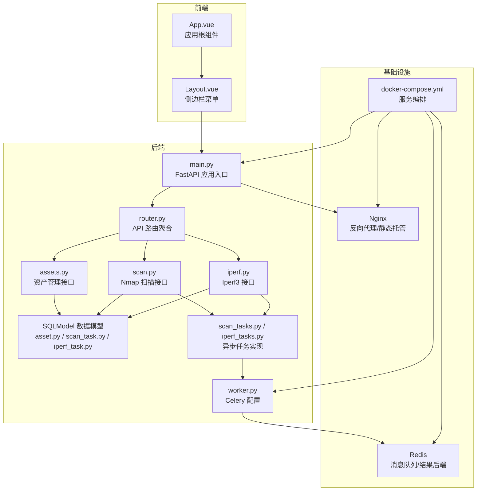
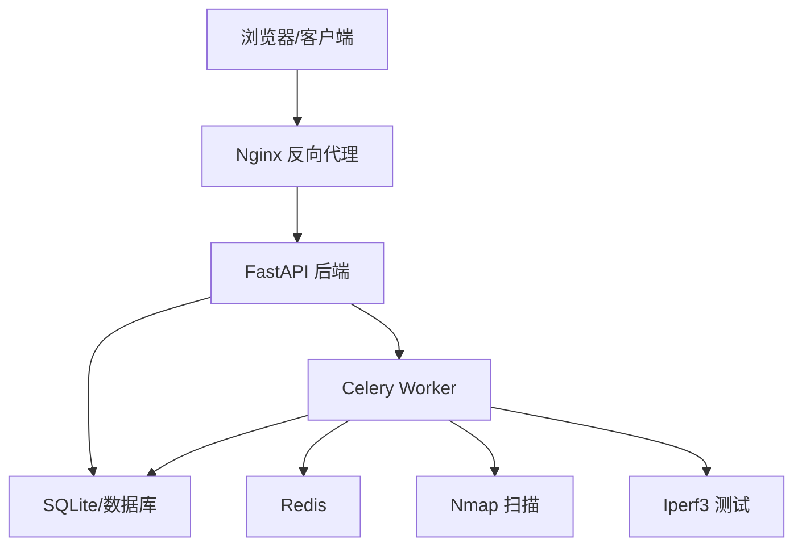
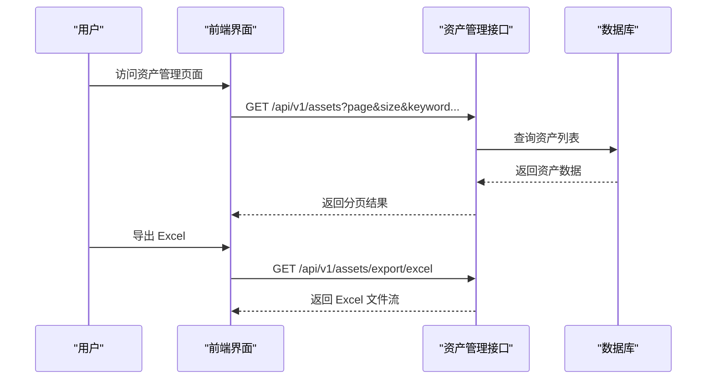
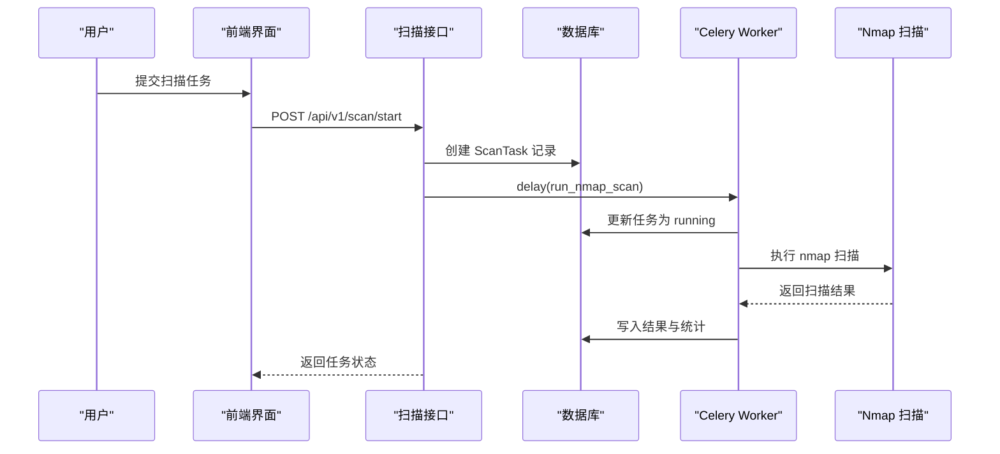
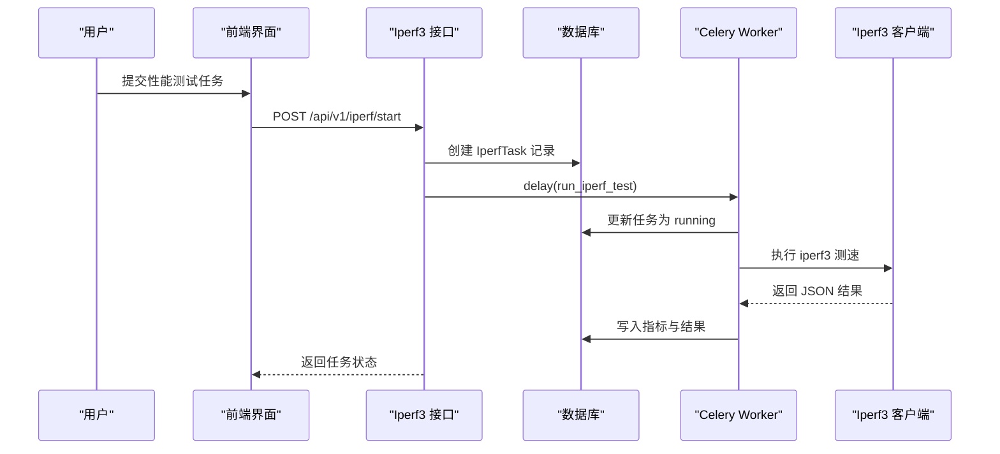
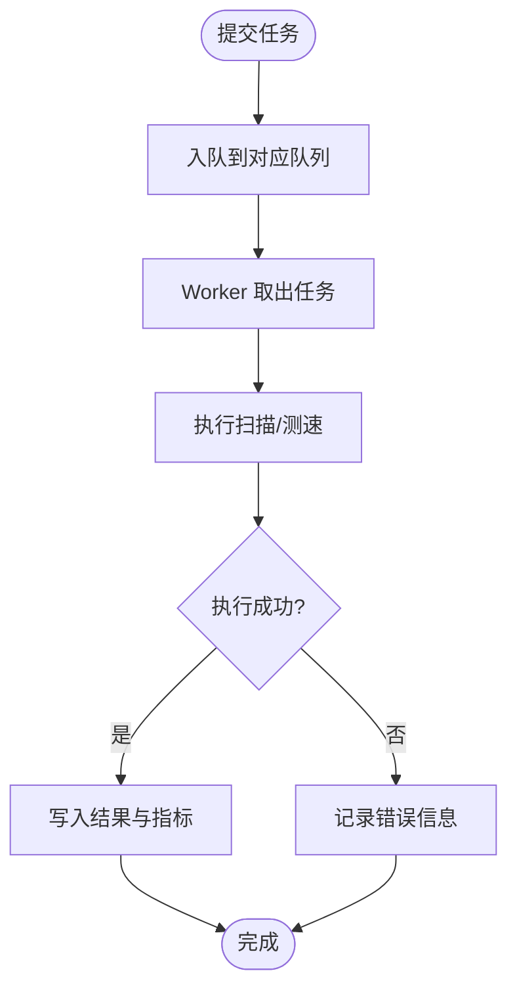
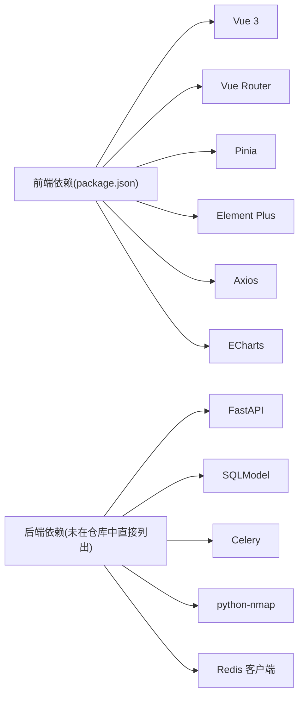

# 项目概述

<cite>
**本文档引用的文件**
- [main.py](file://ops-platform/backend/app/main.py)
- [config.py](file://ops-platform/backend/app/core/config.py)
- [router.py](file://ops-platform/backend/app/api/v1/router.py)
- [assets.py](file://ops-platform/backend/app/api/v1/assets.py)
- [scan.py](file://ops-platform/backend/app/api/v1/scan.py)
- [iperf.py](file://ops-platform/backend/app/api/v1/iperf.py)
- [asset.py](file://ops-platform/backend/app/models/asset.py)
- [scan_task.py](file://ops-platform/backend/app/models/scan_task.py)
- [iperf_task.py](file://ops-platform/backend/app/models/iperf_task.py)
- [worker.py](file://ops-platform/backend/app/tasks/worker.py)
- [scan_tasks.py](file://ops-platform/backend/app/tasks/scan_tasks.py)
- [iperf_tasks.py](file://ops-platform/backend/app/tasks/iperf_tasks.py)
- [docker-compose.yml](file://ops-platform/docker-compose.yml)
- [App.vue](file://ops-platform/frontend/src/App.vue)
- [Layout.vue](file://ops-platform/frontend/src/views/Layout.vue)
- [package.json](file://ops-platform/frontend/package.json)
</cite>

## 目录
1. [引言](#引言)
2. [项目结构](#项目结构)
3. [核心组件](#核心组件)
4. [架构总览](#架构总览)
5. [详细组件分析](#详细组件分析)
6. [依赖分析](#依赖分析)
7. [性能考虑](#性能考虑)
8. [故障排除指南](#故障排除指南)
9. [结论](#结论)
10. [附录](#附录)

## 引言
本项目是一个面向内网环境的运维集成工具平台，旨在统一管理与运维内网中的各类资产、执行安全可控的网络扫描检测，并进行网络性能测试。平台通过模块化设计整合三大核心能力：
- 资产管理：统一登记、查询、导出资产信息，支持凭据加密存储与按条件检索。
- Nmap 扫描：基于 Celery 的异步扫描任务，支持多种扫描模式与结果解析。
- Iperf3 性能测试：异步执行带宽、抖动、丢包等指标测试，支持 TCP/UDP 协议。

平台采用前后端分离架构，后端使用 FastAPI 提供 REST API，前端基于 Vue 3 + Element Plus 构建，通过 Docker Compose 编排部署，包含 Redis 作为消息队列与结果后端、Celery Worker 执行异步任务、Nginx 反向代理与静态资源托管。

## 项目结构
项目采用“后端 + 前端 + 运维编排”的三层组织方式：
- 后端（Python/SQLModel/FastAPI/Celery）：负责业务 API、数据模型、任务调度与执行。
- 前端（Vue 3 + Element Plus）：提供资产管理、Nmap 扫描、Iperf3 测试的可视化界面。
- 运维编排（Docker + docker-compose）：统一打包与部署，包含 Redis、后端、Celery Worker、Nginx 等服务。

图表来源
- [main.py:1-48](file://ops-platform/backend/app/main.py#L1-L48)
- [router.py:1-8](file://ops-platform/backend/app/api/v1/router.py#L1-L8)
- [assets.py:1-75](file://ops-platform/backend/app/api/v1/assets.py#L1-L75)
- [scan.py:1-42](file://ops-platform/backend/app/api/v1/scan.py#L1-L42)
- [iperf.py:1-42](file://ops-platform/backend/app/api/v1/iperf.py#L1-L42)
- [asset.py:1-73](file://ops-platform/backend/app/models/asset.py#L1-L73)
- [scan_task.py:1-43](file://ops-platform/backend/app/models/scan_task.py#L1-L43)
- [iperf_task.py:1-47](file://ops-platform/backend/app/models/iperf_task.py#L1-L47)
- [worker.py:1-30](file://ops-platform/backend/app/tasks/worker.py#L1-L30)
- [scan_tasks.py:1-86](file://ops-platform/backend/app/tasks/scan_tasks.py#L1-L86)
- [iperf_tasks.py:1-59](file://ops-platform/backend/app/tasks/iperf_tasks.py#L1-L59)
- [docker-compose.yml:1-95](file://ops-platform/docker-compose.yml#L1-L95)

章节来源
- [main.py:1-48](file://ops-platform/backend/app/main.py#L1-L48)
- [router.py:1-8](file://ops-platform/backend/app/api/v1/router.py#L1-L8)
- [docker-compose.yml:1-95](file://ops-platform/docker-compose.yml#L1-L95)

## 核心组件
- 应用入口与生命周期
  - FastAPI 应用在启动时自动初始化数据库表结构，提供健康检查端点与 OpenAPI 文档。
  - CORS 中间件允许指定前端域名访问，满足内网联调需求。
- 配置中心
  - 统一从 .env 读取数据库、Redis、Celery、安全算法、CORS 允许列表、允许扫描的内网网段等配置。
- API 路由聚合
  - 将资产管理、Nmap 扫描、Iperf3 测试三大模块的路由统一注册到 /api/v1 前缀下。
- 数据模型
  - 资产模型：包含设备基础信息、凭据字段（加密存储）、协议与端口等。
  - 扫描任务模型：记录目标、扫描类型、参数、进度、状态、结果与计数等。
  - 性能测试模型：记录服务器地址、协议、时长、并发、方向、指标与错误信息等。
- 异步任务与执行器
  - Celery Worker 配置了专用队列（scan/iperf），设置超时、序列化与结果过期策略，确保任务可靠执行。
  - Nmap 扫描与 Iperf3 测试均以 Celery 任务形式异步执行，避免阻塞主请求线程。

章节来源
- [main.py:15-48](file://ops-platform/backend/app/main.py#L15-L48)
- [config.py:8-40](file://ops-platform/backend/app/core/config.py#L8-L40)
- [router.py:1-8](file://ops-platform/backend/app/api/v1/router.py#L1-L8)
- [asset.py:19-73](file://ops-platform/backend/app/models/asset.py#L19-L73)
- [scan_task.py:12-43](file://ops-platform/backend/app/models/scan_task.py#L12-L43)
- [iperf_task.py:14-47](file://ops-platform/backend/app/models/iperf_task.py#L14-L47)
- [worker.py:4-30](file://ops-platform/backend/app/tasks/worker.py#L4-L30)

## 架构总览
平台采用“API 层 + 业务层 + 任务层 + 存储层 + 基础设施层”的分层架构：
- API 层：FastAPI 提供 REST 接口，路由聚合各模块。
- 业务层：各模块的 CRUD 与流程控制逻辑。
- 任务层：Celery Worker 异步执行扫描与测速任务，写回任务状态与结果。
- 存储层：SQLModel + SQLite（默认）持久化业务数据；Redis 作为消息队列与结果后端。
- 基础设施层：Docker Compose 编排，Nginx 提供反向代理与静态资源服务。

图表来源
- [docker-compose.yml:16-87](file://ops-platform/docker-compose.yml#L16-L87)
- [main.py:22-42](file://ops-platform/backend/app/main.py#L22-L42)
- [worker.py:4-27](file://ops-platform/backend/app/tasks/worker.py#L4-L27)

## 详细组件分析

### 资产管理模块
- 功能特性
  - 分页查询：支持关键词、设备类型、状态过滤。
  - 新增/更新：支持凭据加密存储，返回是否具备凭据标记。
  - 导出 Excel：批量导出资产清单，便于线下归档与审计。
- 数据模型要点
  - 资产基础字段：名称、IP、类型、型号、位置、负责人、用途、操作系统、标签、备注、状态。
  - 凭据字段：用户名、密码、enable 密码（加密存储），协议与 SSH 端口。
- 前端交互
  - 侧边栏导航至资产管理页面，支持列表展示与导出操作。

图表来源
- [assets.py:13-75](file://ops-platform/backend/app/api/v1/assets.py#L13-L75)
- [asset.py:5-73](file://ops-platform/backend/app/models/asset.py#L5-L73)
- [Layout.vue:23-29](file://ops-platform/frontend/src/views/Layout.vue#L23-L29)

章节来源
- [assets.py:13-75](file://ops-platform/backend/app/api/v1/assets.py#L13-L75)
- [asset.py:5-73](file://ops-platform/backend/app/models/asset.py#L5-L73)
- [Layout.vue:23-29](file://ops-platform/frontend/src/views/Layout.vue#L23-L29)

### Nmap 扫描模块
- 功能特性
  - 支持多种扫描类型（ping、端口、服务、全量），可自定义端口与额外参数。
  - 任务状态跟踪：pending/running/completed/failed，支持进度与计数统计。
  - 结果解析：统计主机数量与开放端口数量，JSON 结果持久化。
  - 安全限制：仅允许对特定内网网段进行扫描，越权目标直接失败。
- 异步执行流程
  - 创建扫描任务 → 触发 Celery 任务 → 更新状态与结果 → 返回完成状态。

图表来源
- [scan.py:10-16](file://ops-platform/backend/app/api/v1/scan.py#L10-L16)
- [scan_tasks.py:25-63](file://ops-platform/backend/app/tasks/scan_tasks.py#L25-L63)
- [scan_task.py:12-25](file://ops-platform/backend/app/models/scan_task.py#L12-L25)

章节来源
- [scan.py:10-42](file://ops-platform/backend/app/api/v1/scan.py#L10-L42)
- [scan_tasks.py:12-86](file://ops-platform/backend/app/tasks/scan_tasks.py#L12-L86)
- [scan_task.py:5-43](file://ops-platform/backend/app/models/scan_task.py#L5-L43)

### Iperf3 性能测试模块
- 功能特性
  - 支持 TCP/UDP 协议、指定时长与并发、反向测试。
  - 指标采集：带宽（Mbps）、抖动（ms）、丢包率（%）、重传次数。
  - 异步执行：任务状态与结果 JSON 持久化，支持撤销运行中任务。
- 异步执行流程
  - 创建测试任务 → 触发 Celery 任务 → 执行 iperf3 → 解析 JSON → 写回指标。

图表来源
- [iperf.py:10-16](file://ops-platform/backend/app/api/v1/iperf.py#L10-L16)
- [iperf_tasks.py:10-42](file://ops-platform/backend/app/tasks/iperf_tasks.py#L10-L42)
- [iperf_task.py:14-27](file://ops-platform/backend/app/models/iperf_task.py#L14-L27)

章节来源
- [iperf.py:10-42](file://ops-platform/backend/app/api/v1/iperf.py#L10-L42)
- [iperf_tasks.py:10-59](file://ops-platform/backend/app/tasks/iperf_tasks.py#L10-L59)
- [iperf_task.py:5-47](file://ops-platform/backend/app/models/iperf_task.py#L5-L47)

### 任务执行与队列设计
- 队列隔离
  - 扫描任务与性能测试任务分别进入 scan 与 iperf 队列，避免相互影响。
- 超时与可靠性
  - 设置软/硬超时、UTC 时间、结果过期、延迟确认与预取乘数，提升稳定性。
- 任务撤销
  - 对于 pending/running 状态的任务，支持通过 Celery 控制撤销。

图表来源
- [worker.py:11-27](file://ops-platform/backend/app/tasks/worker.py#L11-L27)
- [scan_tasks.py:25-63](file://ops-platform/backend/app/tasks/scan_tasks.py#L25-L63)
- [iperf_tasks.py:10-42](file://ops-platform/backend/app/tasks/iperf_tasks.py#L10-L42)

章节来源
- [worker.py:4-30](file://ops-platform/backend/app/tasks/worker.py#L4-L30)
- [scan_tasks.py:25-63](file://ops-platform/backend/app/tasks/scan_tasks.py#L25-L63)
- [iperf_tasks.py:10-42](file://ops-platform/backend/app/tasks/iperf_tasks.py#L10-L42)

## 依赖分析
- 外部工具依赖
  - Nmap：用于网络发现与端口服务识别。
  - Iperf3：用于网络吞吐与质量测试。
- 容器化依赖
  - Redis：消息队列与结果后端。
  - Nginx：反向代理与静态资源托管。
  - 后端与 Worker：共享卷与网络，依赖宿主机或容器内安装的外部工具。
- 前端依赖
  - Vue 3、Element Plus、Vue Router、Pinia、Axios、ECharts 等。

图表来源
- [package.json:1](file://ops-platform/frontend/package.json#L1)
- [docker-compose.yml:34-35](file://ops-platform/docker-compose.yml#L34-L35)

章节来源
- [package.json:1](file://ops-platform/frontend/package.json#L1)
- [docker-compose.yml:34-35](file://ops-platform/docker-compose.yml#L34-L35)

## 性能考虑
- 异步化：扫描与测速通过 Celery 异步执行，避免阻塞 API 请求线程。
- 队列隔离：scan/iperf 队列分离，降低高并发下的相互干扰。
- 超时与限流：设置软/硬超时、结果过期与延迟确认，提高系统稳定性。
- 数据库：SQLite 默认配置适合中小规模场景；如需扩展，建议迁移到 PostgreSQL 并启用连接池与索引优化。
- 前端：使用 Element Plus 与 ECharts 进行高效渲染，建议开启懒加载与分页以减少首屏压力。

## 故障排除指南
- 无法访问 API 文档
  - 确认 FastAPI 的 docs_url/redoc_url 配置正确，且 CORS 允许前端域名。
- 扫描任务失败
  - 检查目标是否在 ALLOWED_SCAN_NETWORKS 列表内；查看任务错误信息与日志。
- Iperf3 执行失败
  - 确认 iperf3 服务端可达、端口与协议配置正确；检查超时与权限。
- 任务无法撤销
  - 确认 Celery Broker/Backend 正常，任务状态为 pending/running。
- 前端无法加载
  - 检查 Nginx 配置与静态资源路径映射，确认后端服务已就绪。

章节来源
- [main.py:22-42](file://ops-platform/backend/app/main.py#L22-L42)
- [config.py:31-37](file://ops-platform/backend/app/core/config.py#L31-L37)
- [scan_tasks.py:32-37](file://ops-platform/backend/app/tasks/scan_tasks.py#L32-L37)
- [iperf_tasks.py:23-42](file://ops-platform/backend/app/tasks/iperf_tasks.py#L23-L42)
- [docker-compose.yml:74-86](file://ops-platform/docker-compose.yml#L74-L86)

## 结论
本项目通过统一的 API 与任务执行框架，将资产管理、Nmap 扫描与 Iperf3 性能测试有机整合，形成一套面向内网运维的轻量级集成工具平台。其模块化设计、异步执行与容器化部署，既保证了易用性，也兼顾了可扩展性与安全性。对于需要在内网环境中进行资产盘点、安全扫描与性能评估的团队，该平台提供了清晰、稳定且可演进的解决方案。

## 附录
- 部署与运行
  - 使用 docker-compose 启动 Redis、后端、Celery Worker、Nginx 与前端静态资源。
  - 在宿主机或容器内安装 Nmap 与 Iperf3，确保后端可通过 PATH 或配置项访问。
- 开发与调试
  - 前端通过 Vite 开发服务器运行，后端支持热重载挂载卷。
  - 建议在 .env 中配置生产所需的密钥与敏感参数。

章节来源
- [docker-compose.yml:1-95](file://ops-platform/docker-compose.yml#L1-L95)
- [config.py:18-21](file://ops-platform/backend/app/core/config.py#L18-L21)
